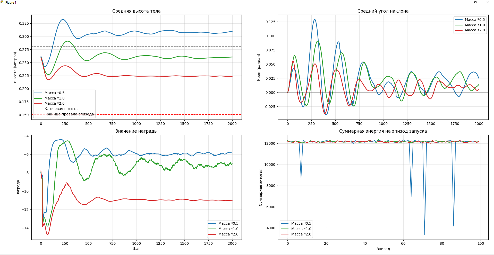

# Тестовое задание в BE2R Lab

Выбранной тематикой является обучение с подкреплением (RL). На основе анализа статей 
выявил проблему и сформулировал гипотезу для ее преодоления. Для обоснования 
проблемы написан код, показывающий результаты.  

## Содержание:
- [Анализ статей](#analyze)
- [Выявленная проблема](#problem)
- [Гипотеза](#hypothesis)
- [Программная часть](#code)
- [Установка и запуск](#install)
- [Результаты](#results)

## <a id="analyze"> Анализ статей </a>

### Learning Quadrupedal Locomotion over Challenging Terrain
###### Joonho Lee, Jemin Hwangbo, Lorenz Wellhausen, Vladlen Koltun, Marco Hutter

В данной [статье](articles/article_1.pdf) по обучению четырехногого шагающего робота с использованием 
обучения с подкреплением показано, что возможно использовать только 
проприоцептивную информацию, без использования значений с внешних датчиков. 
Авторы производят обучение робота в симуляции, после чего итоговый контроллер 
показывает устойчивое поведение в условиях, которые отличаются от обучающих. То есть 
для компенсации перехода в реальность после симуляции (sim-to-real) в статье авторы 
применили рандомизацию физических контактных параметров во время обучения, включая 
массу, трение, задержки и др.  
С одной стороны это обеспечивает устойчивость в 
отличающихся от симуляции условиях, но с другой стороны эта случайность параметров 
затрудняет анализ этой устойчивости, и появляется трудность проектирования функции 
награды, особенно для режимов робота по удержанию равновесия.  

---

### Learning robust perceptive locomotion for quadrupedal robots in the wild
###### Takahiro Miki, Joonho Lee, Jemin Hwangbo, Lorenz Wellhausen, Vladlen Koltun, Marco Hutter

В этой [статье](articles/article_2.pdf) по сравнению с предыдущей проприоцептивная информация с датчиков 
дополняется экстероцептивными данными (камера, лидар). Здесь данные о рельефе 
местности с внешних сенсоров используются нейросетевыми моделями и 
объединяются с проприоцептивными измерениями. За счет данного подхода достигается 
адаптация шага за счет предсказания, то есть заранее учитываются особенности рельефа, и 
достигается более высокая скорость робота, нежели если бы он использовал только 
проприоцептивные данные, как в предыдущей статье.  
Но несмотря на высокую практическую эффективность, такой подход с использованием 
экстероцептивных датчиков по анализу глубины рельефа и предсказательной адаптации 
зависим от качества окружающей среды. При тумане, задымлении, переосвещенности 
преимущество имеют подходы, ориентированные на устойчивое движение в условиях 
неполной или недостоверной информации об окружении.  

---

### DreamWaQ: Learning Robust Quadrupedal Locomotion With Implicit Terrain Imagination via Deep Reinforcement Learning
###### Aswin Nahrendra, Byeongho Yu, Hyun Myung

Данная [статья](articles/article_3.pdf), как и первая, имеет подход по использованию только проприоцептивной 
информации для обучения с подкреплением. Отличие здесь в том, что авторы используют 
подход по формированию неявного внутреннего представления характеристик опорной 
поверхности, наблюдая за последствиями движения робота. Под неявным понимается, что 
отсутствует явная реконструкция параметров среды (рельеф, трение и др.) в виде отдельных 
измеряемых величин или структурированной модели. То есть обучение происходит так, что 
свойства поверхности кодируются во внутренних состояниях нейросетевых компонентов. 
Робот сначала касается поверхности/препятствия при движении и уже потом понимает, что 
ему делать. В любом случае появляется необходимость допущения отклонений, 
скольжений, ударов. В задачах движения это допустиммо, однако при удержании 
равновесия стратегия приводит к постоянным корректировкам положения и колебаниям. Sim-toreal хорошо показан для движения, но в режимах длительного стояния или медленного 
движения поведение становится потенциально неустойчивым, а это осложняет анализ и применение на практике.  

---

###  Learning to Walk in Minutes Using Massively Parallel Deep Reinforcement Learning
###### Nikita Rudin, David Hoeller, Philipp Reist

В данной [статье](articles/article_4.pdf) представлен фреймворк **legged_gym**, который позволяет параллельно на 
графическом процессоре обучать с подкреплением множество роботов, сокращая тем 
самым время на обучение. Sim-to-real обеспечивается за счет генерации параметров среды, 
добавления шумов, возмущений при обучении, а также за счет поступления в алгоритм 
обучения карты с лидара, но из-за недостаточного качества этой карты и шумов sim-to-real получается хуже.  
Также их алгоритм обучения не ограничен в выборе режима движения и 
походке, могут появляться артефакты. Здесь они поставили упор на время обучения 
роботов, что тоже хорошо, потому что параллелизм много где применяется в других 
областях программирования. Однако проблема физически согласованных иерархических 
архитектур управления остается за рамками данного подхода.  

---

### HiLMa-Res: A General Hierarchical Framework via Residual RL for Combining Quadrupedal Locomotion and Manipulation 
###### Xiaoyu Huang, Qiayuan Liao, Yiming Ni, Zhongyu Li, Laura Smith, Sergey Levine, Xue Bin Peng, Koushil Sreenath
В этой [статье](articles/article_5.pdf) представлена иерархическая структура управления, 
включающая физически согласованный контроллер, основанный на центральном генераторе паттернов, и 
обучаемый с подкреплением верхний уровень, формирующий целевые команды и 
остаточные траектории. За счет формирования структуры походки через ЦГП, изоляцию 
обучения с подкреплением от этого, удается избежать вырожденных режимов поведения 
робота, что снижает разрыв между симуляцией и реальностью.  
Однако адаптивность системы ограничена той самой заданной структурой движения. Дополнительным 
ограничением является усложнение архитектуры и процесса обучения, что подчеркивает 
компромисс между физической интерпретируемостью, устойчивостью и универсальностью подхода.  

---

## <a id="problem">  Выявленная проблема </a>

После анализа вышеописанных статей обнаружил, что остаётся актуальной проблема формирования 
устойчивого стояния при использовании обучения с подкреплением для четырёхногих роботов. 
Большинство рассмотренных подходов в первую очередь ориентированы на задачи ходьбы, 
где равновесие может быть восстановлено за счет следующего шага или изменения траектории опоры. 
В таких условиях устойчивость достигается разными способами, например, через рандомизацию параметров среды, 
предсказательной адаптации шага по информации с внешних датчиков или неявного формирования внутренних представлений 
в нейросетевых моделях. В результате равновесие носит больше статистический характер и не опирается на 
явно заданную физическую структуру управления.  
В режимах стояния и удержания равновесия накопленная ошибка в расчетах, люфт в приводах, неточность контакта с 
поверхностью приводит к постоянным корректировкам положения. Так же проектирование 
функции награды имеет важную роль, иначе робот будет либо дрожать, либо найдет 
оптимальное по функции вознаграждения положение, физически не связанное с нашим 
восприятием стойки (например будет не до конца поднят, находясь в полулежачем состоянии).  


## <a id="hypothesis"> Гипотеза </a>
На основании анализа статей и результатов собственного эксперимента (см. ниже) выдвинул
следующую гипотезу:  
**Использование обучения с подкреплением без явной физической структуры
управления и без иерархического разделения задач устойчивости и адаптации
приводит к формированию вырожденных устойчивых режимов, которые формально
оптимальны по функции награды, но непригодны для реального движения и
равновесия.**  
Преодоление данного ограничения возможно за счёт внедрения физически согласованных
иерархических архитектур управления, в которых базовый уровень обеспечивает
устойчивое движение и равновесие, а обучаемый уровень отвечает за адаптацию к
неопределенности среды.  
Похожей является описанная выше статья HiLMa-Res, однако в ней иерархия вводится преимущественно
как средство повышения надежности и переносимости в реальную систему. В данном
задании упор делается именно на формулировке самой проблемы как структурного
ограничения обучения с подкреплением, а также на ее экспериментальном проявлении в
режиме статического удержания положения роботом.

## <a id="code"> Программная часть </a>

В среде MuJoCo с обучением стратегии методом PPO наблюдается характерный эффект: 
при корректно стабилизирующихся графиках вознаграждения и высоты корпуса робот 
обучается удерживать устойчивое, но функционально некорректное состояние - 
стабилизацию в полулежачем положении.  
Это подтверждает, что стандартная функция вознаграждения, ориентированная на 
устойчивость и энергоэффективность, не гарантирует формирования физически 
осмысленного поведения. Без дополнительных архитектурных, структурных ограничений 
робот находит оптимальные решения, но они не соответствуют исходной задаче 
управления равновесием.  

### Стек проекта:  
- Python 3.10+
- MuJoCo  

### Проект содержит
- Робот Google Barkour vB ([assets](assets), [barkour_vb.xml](barkour_vb.xml), 
[barkour_vb_rev_1_0_head_straight.urdf](barkour_vb_rev_1_0_head_straight.urdf), [scene.xml](scene.xml));
- Окружение для обучения с подкреплением робота: [barkour_env.py](envs/barkour_env.py);
- Модуль обучения с PPO: [train.py](train.py);
- Модуль оценки обучения: [evaluate.py](evaluate.py);
- Модуль построения графиков: [plot.py](plot.py);
- Модуль симуляции обучения: [play.py](play.py).


### <a id="install"> Установка и запуск </a>
1. Создать виртуальное окружение Python **venv**
```shell
python -m venv venv
```
2. Войти в **venv**  
Windows:
```shell
.\venv\Scripts\Activate.ps1
```
Linux:
```shell
source venv/bin/activate
```
3. Установить библиотеки
```shell
pip install -r requirements.txt
```
4. Запустить обучение
```shell
python -m train
```
5. Запустить оценку
```shell
python -m evaluate
```
6. Запустить отрисовку графиков
```shell
python -m plot
```
7. Выбрать коэффициент массы робота в модуле [play.py](play.py)
(**MASS_SCALE** = 0.5, 1.0, 2.0 (на выбор)) и запустить:
```shell
python -m play
```
---

## <a id="results"> Результаты </a>

Использовались различные коэффициенты массы робота (0.5, 1.0, 2.0 как 
50%, 100%, 200% массы робота соответственно). Полученные графики после 
обучения на 2000 эпизодах:


Как мы видим, высота корпуса робота и функция награды стабилизируется, в особенности 
хорошо для более тяжелого робота (колебания крена тоже меньше).  
Однако, как говорилось в проблеме и гипотезе выше ("... оптимальное по функции вознаграждения положение, физически не связанное с нашим 
восприятием стойки..."), при обучении с RL наблюдаем, 
что робот не прям стоит, а находится в полулежачем состоянии, делаю различные корректировки положения. 
Ниже пример для робота, массой в 2 раза больше исходной по всем деталям:


---

### Лицензия
Проект содержит модель робота Google Barkour vB.  
Авторские права принадлежат **DeepMind Technologies Limited**, 2023 г.  
Директория с файлами [assets](assets) и файлы [barkour_vb.xml](barkour_vb.xml), [barkour_vb_rev_1_0_head_straight.urdf](barkour_vb_rev_1_0_head_straight.urdf) 
находятся под лицензией [ Apache-2.0 License](LICENSE).  
Источник: <a href="https://github.com/google-deepmind/mujoco_menagerie/tree/main/google_barkour_vb">google_barkour_vb</a>

Изменения в файле сцены (сдвиг пола через "pos"), модули окружения робота, обучения, оценки, отрисовки графиков, запуска симуляции 
выполнил Михаил Рогальский.

---

**Университет ИТМО, 2026 г.  
Номер ИСУ автора: 506153**
